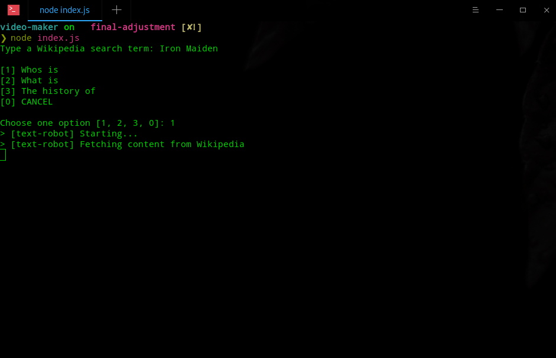
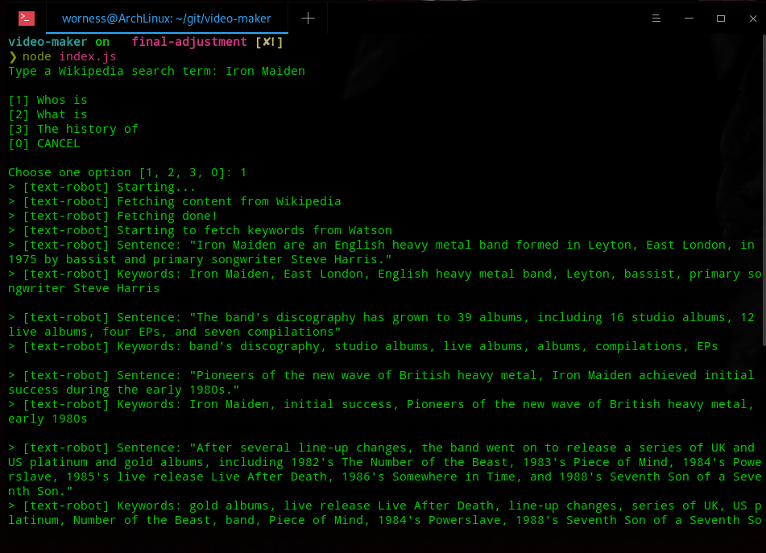
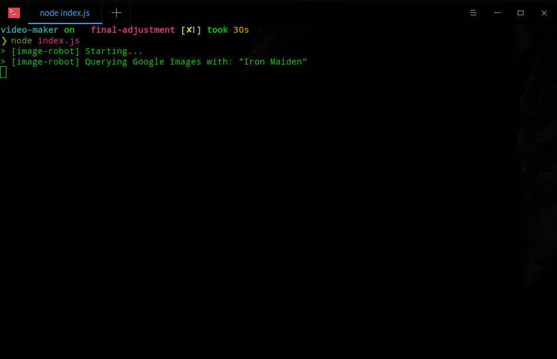
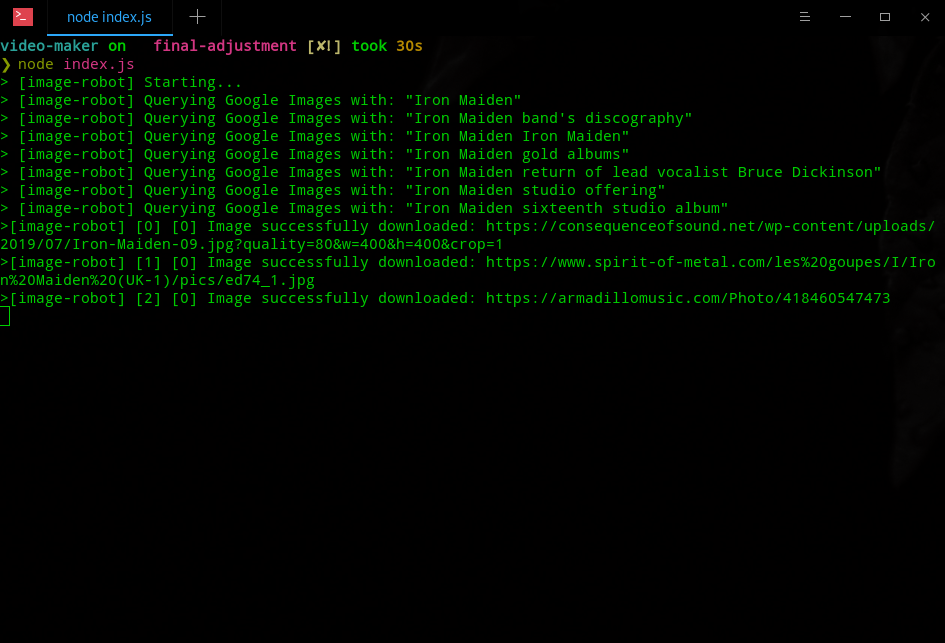
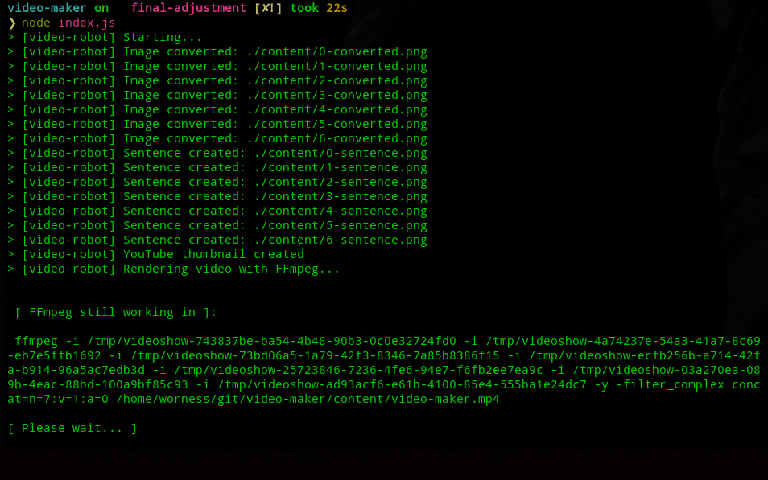
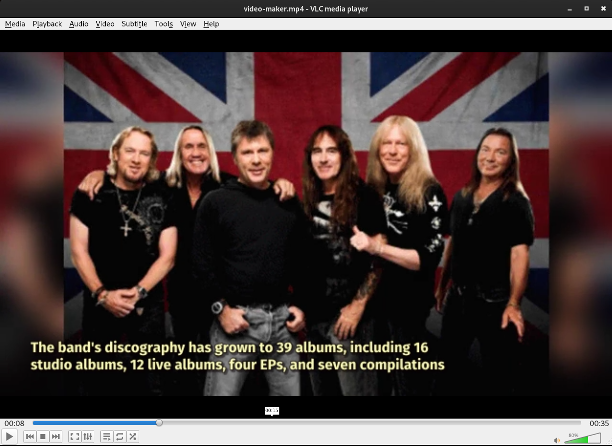
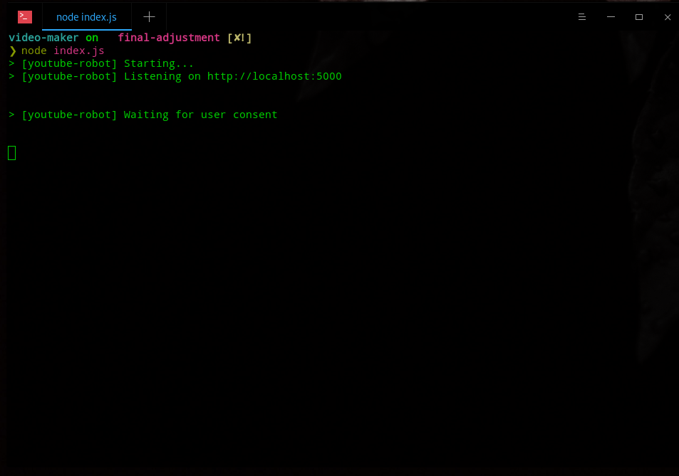
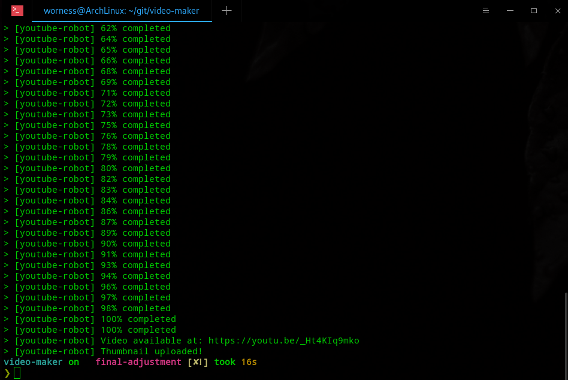
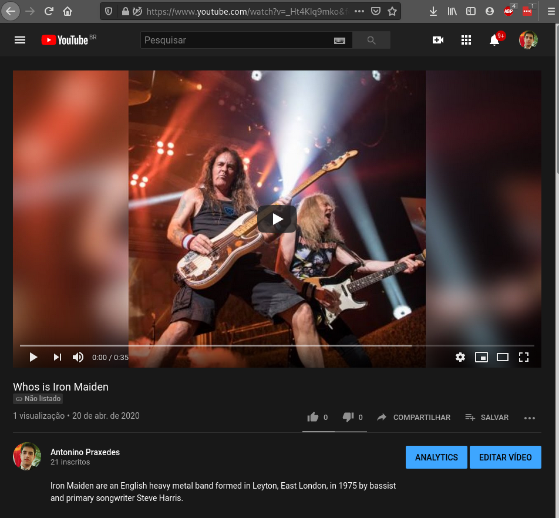

<p align="center">
  
  
  
  <a href="https://github.com/apfjunior">
    
  </a>
</p>

> :film_projector: A minha versão do projeto, ao invés de usar o software proprietário da Adobe (After Effects) do projeto original, ajustei para uso de renderização e efeitos com 02 softwares livres para aplicação de efeitos e conversão do vídeo: [Videoshow](https://www.npmjs.com/package/videoshow) e [FFmpeg](https://www.ffmpeg.org/) respectivamente. Rodando em qualquer sistema operacional, inclusive no linux, onde o software da Adobe não é compatível oficialmente nessa plataforma.

## Sobre o projeto :bulb:

Trata-se de uma POC (Prova de conceito) do projeto de código-aberto do [Filipe Deschamps](https://www.youtube.com/watch?v=kjhu1LEmRpY), onde basicamente o usuário informa algum tema de pesquisa para o vídeo, depois escolhe o filtro de entrada: "Who is", "What is" ou "The history of". Onde a API de busca no Wikipedia da [Algorithmia](https://algorithmia.com/), utilizará da Machine Learning para efetuar o resumo com base no filtro escolhido anteriormente pelo usuário. 

Com o resumo salvo, a próxima etapa será extrair do conteúdo, os metadados e as "keywords" com o uso da API de [Azure Text Analytics](https://azure.microsoft.com/en-us/services/cognitive-services/text-analytics/) da Microsoft. 

Após as "keywords" coletadas, serão utilizadas como base na busca das imagens, utilizando a API do Google Search/Image. Pois a ideia é lançar a imagem referenciando a legenda sobre o tema durante o vídeo.

Com as imagens organizadas, será aplicado um template prefixados no vídeo, convertendo as imagens extraídas, o resumo recolhido na primeira fase, renderizando o vídeo ao formato ".mp4".

Com o vídeo renderizado, será aplicada a API do YouTube, possibilitando o login com as credenciais para Upload do vídeo automaticamente no canal do YouTube, já incluindo os campos obrigatórios do vídeo como título, descrição e Thumbnail. (Por default, fica como vídeo "não listado"). 

Todas essas etapas: / Recolher conceito / Download Imagens / Renderização Vídeo / Upload YouTube / poderão ser utilizadas separademente.

## :information_source: How To Use

Por ser uma POC, necessitará das chaves das API's utilizadas no projeto. Clicando [aqui](https://github.com/filipedeschamps/video-maker), será direcionado ao README do projeto original com os passos para configuração.

Na minha adaptação para ferramenta FREE, precisará das dependências:

```bash
# Videoshow
$ npm i videoshow

# FFmpeg
$ npm install ffmpeg

# @ffmpeg-installer/ffmpeg
$ npm install --save @ffmpeg-installer/ffmpeg

# @ffprobe-installer/ffprobe
$ npm install --save @ffprobe-installer/ffprobe

# Open
$ npm install open
```
Demais dependências utilizadas:

```bash
# Readline
$ npm install readline-sync

## Algorithmia Market Place Machine Learning
$ npm i algorithmia

# Azure Text Analytics
$ npm i azure-ai-textanalytics

# Google APIs
$ npm i googleapis

# Image Downloader
$ npm i image-downloader

# ImageMagick
https://imagemagick.org/script/download.php

# GM
$ npm i gm

# Express
$ npm i express
```

## ScreenShots

<p align="center">
  
  
  
  
  
  
  
  
  
</p>

<p>Check it out Youtube: https://www.youtube.com/watch?v=_Ht4KIq9mko&feature=youtu.be</p>

### :recycle: Como contribuir

- Fork esse repositório;
- Crie uma branch com a sua feature: `git checkout -b my-feature`
- Commit suas mudanças: `git commit -m 'feat: My new feature'`
- Push a sua branch: `git push origin my-feature`


## :memo:  License

MIT License - Veja [LICENSE](https://opensource.org/licenses/MIT) para mais detalhes.

---
**Created by Antonino Praxedes!  👋🏻 [Get in touch!](https://www.linkedin.com/in/antoninopraxedes/)**

## :information_source: How To Use

Por ser uma POC, necessitará das chaves das API's utilizadas no projeto. Clicando [aqui](https://github.com/filipedeschamps/video-maker), será direcionado ao README do projeto original com os passos para configuração.

Na minha adaptação para ferramenta FREE, precisará das dependências:

```bash
# moviepy
$ pip install moviepy

# google-auth
$ pip install google-auth

# google-api-python-client
$ pip install google-api-python-client

# requests
$ pip install requests
```
Demais dependências utilizadas:

```bash
# json
$ pip install json

# os
$ pip install os

# googleapiclient
$ pip install googleapiclient

# azure-ai-textanalytics
$ pip install azure-ai-textanalytics

# telepot
$ pip install telepot
```

## Telegram Bot Integration

To set up and run the Telegram bot using the Telepot library, follow these steps:

1. Install the Telepot library:
```bash
$ pip install telepot
```

2. Create a new bot on Telegram by talking to the BotFather and obtain your bot's API key.

3. Create a file named `telegram_bot.py` and add the following code:
```python
import telepot
from telepot.loop import MessageLoop
import main
import schedule
import time
import logging

# Configure logging
logging.basicConfig(level=logging.INFO, format='%(asctime)s - %(levelname)s - %(message)s')

def handle_message(msg):
    chat_id = msg['chat']['id']
    command = msg['text']

    try:
        if command == '/start':
            bot.sendMessage(chat_id, "Welcome to the Video Maker Bot! Send me a topic to create a video.")
        elif command == '/help':
            bot.sendMessage(chat_id, "Available commands:\n/start - Start the bot\n/help - Display this help message\n/status - Check the status of the video creation process\n/cancel - Cancel the current video creation process\n/schedule - Schedule a video creation task\n/customize - Customize video creation options")
        elif command == '/status':
            bot.sendMessage(chat_id, "The video creation process is currently in progress.")
        elif command == '/cancel':
            bot.sendMessage(chat_id, "The video creation process has been canceled.")
        elif command.startswith('/schedule'):
            schedule_time = command.split(' ')[1]
            schedule.every().day.at(schedule_time).do(main.run_video_maker, command.split(' ')[2])
            bot.sendMessage(chat_id, f"Video creation task scheduled at {schedule_time}.")
        elif command.startswith('/customize'):
            options = command.split(' ')[1:]
            main.run_video_maker_with_options(options)
            bot.sendMessage(chat_id, "Your video has been created with the customized options and uploaded to YouTube!")
        else:
            main.run_video_maker(command)
            bot.sendMessage(chat_id, "Your video has been created and uploaded to YouTube!")
    except Exception as e:
        logging.error(f"Error handling message: {e}")
        bot.sendMessage(chat_id, "An error occurred while processing your request. Please try again later.")

bot = telepot.Bot('YOUR_TELEGRAM_BOT_API_KEY')
MessageLoop(bot, handle_message).run_as_thread()

logging.info('Listening for incoming messages...')

while True:
    schedule.run_pending()
    time.sleep(1)
```

4. Update the `main.py` file to import and run the Telegram bot:
```python
import telegram_bot  # Import the telegram_bot.py file

def main():
    input_robot.run()
    text_robot.run()
    image_robot.run()
    video_robot.run()
    youtube_robot.run()
    telegram_bot  # Run the Telegram bot

if __name__ == "__main__":
    main()
```

5. Run the `main.py` file to start the Telegram bot and listen for incoming messages.

## Customization Options

Users can now customize various aspects of the video creation process by providing additional options in their commands. For example, users can specify the video duration, image sources, and text styles.

## Scheduled Video Creation

The bot now supports scheduling video creation tasks. Users can schedule a video creation task by using the `/schedule` command followed by the time and topic. The bot will automatically create and upload the video at the specified time.
